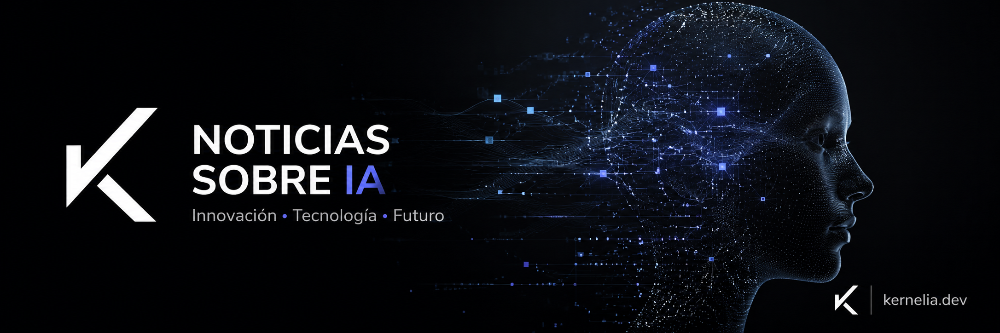

<!-- PROJECT SHIELDS -->
[![Contributors][contributors-shield]][contributors-url]
[![Forks][forks-shield]][forks-url]
[![Issues][issues-shield]][issues-url]
[![License][license-shield]][license-url]
[![Release][release-shield]][release-url]

<!-- PROJECT LOGO -->
<br />
<div align="center">
  <h1>
    
    Kernelia
  </h1>

  <p align="center">
    Agregador de noticias sobre Inteligencia Artificial, clasificadas y resumidas automáticamente.
    <br />
    <a href="https://kernelia.dev"><strong>kernelia.dev »</strong></a>
    ·
    <a href="https://github.com/raulfdeztdo/kernelia/issues">Reportar Bug</a>
    ·
    <a href="https://github.com/raulfdeztdo/kernelia/issues">Solicitar Funcionalidad</a>
  </p>

  

  <p align="center">
    
    
    
    
    
    
    
    
    
  </p>
</div>

<!-- TABLE OF CONTENTS -->
<details open>
  <summary>Tabla de contenidos</summary>
  <ol>
    <li><a href="#sobre-el-proyecto">Sobre el proyecto</a></li>
    <li><a href="#stack">Stack</a></li>
    <li><a href="#funcionalidades">Funcionalidades</a></li>
    <li><a href="#cómo-funciona">Cómo funciona</a></li>
    <li><a href="#estado-del-proyecto">Estado del proyecto</a></li>
    <li><a href="#licencia">Licencia</a></li>
    <li><a href="#contacto">Contacto</a></li>
  </ol>
</details>

## Sobre el proyecto

Cada día salen decenas de novedades sobre Inteligencia Artificial repartidas por blogs, medios y feeds de empresas. Mantenerse al día sin sobrecargarse es difícil: una parte del contenido se repite, otra es ruido y lo verdaderamente relevante se pierde en el medio.

**Kernelia** recopila publicaciones de medios de referencia sobre IA, las deduplica, las clasifica por categoría y genera un resumen breve mediante un agente IA. La web pública muestra las noticias más recientes primero, con filtros por categoría y búsqueda libre. Sin login: cualquiera puede visitarla. Las más relevantes se publican automáticamente en Mastodon, Bluesky y Telegram.

### ¿Por qué este proyecto?

- **Sin ruido** — Las noticias se clasifican en 10 categorías concretas y se resumen, para escanear el feed en segundos.
- **Auto-mantenido** — Un cron ingesta nuevas publicaciones cada 3h, el agente IA las clasifica cada 30min y el broadcaster las distribuye a redes sociales sin intervención humana.
- **Bilingüe** — Interfaz nativa en español e inglés. Títulos y resúmenes generados en ambos idiomas por el agente.
- **Newsletter semanal** — Digest opcional cada domingo con los artículos más relevantes de la semana.
- **Coste cero** — Stack íntegramente en planes gratuitos (Vercel + Supabase + Cerebras + Resend).

## Stack

| Capa | Tecnología |
|---|---|
| Framework | Next.js 15 (App Router, RSC) |
| Lenguaje | TypeScript estricto |
| UI | Tailwind v4 + shadcn/ui |
| i18n | next-intl (ES default, EN) |
| Base de datos | Supabase Postgres |
| ORM | Drizzle |
| LLM | Cerebras `gpt-oss-120b` — SDK OpenAI-compatible |
| Ingesta | rss-parser |
| Validación | Zod |
| Email | Resend |
| Broadcaster | Mastodon · Bluesky · Telegram |
| Hosting | Vercel (Hobby) |
| Cron | GitHub Actions |
| Tests | Vitest + Playwright |

## Funcionalidades

**Feed público:**
- **Listado de noticias** — Ordenado por fecha descendente, paginación append-style sin recarga.
- **Filtros por categoría** — Multi-selección: LLMs, agentes, investigación, productos, robótica, regulación, seguridad, multimodal, coding AI, otros.
- **Búsqueda libre** — Por palabras clave en título y resumen, con debounce en cliente e `ILIKE` en servidor.
- **UI bilingüe** — Español por defecto, inglés disponible. Títulos y resúmenes generados en ambos idiomas.
- **SEO** — Metadata por locale (OG, canonical, hreflang + x-default), `sitemap.xml`, `robots.txt`.
- **RSS** — `/rss.xml?lang=es|en` con los últimos artículos clasificados.
- **Stats públicas** — `/api/stats` con métricas abiertas (artículos, tokens, actividad).
- **Share buttons** — Copiar enlace, compartir por email, compartir en Mastodon.
- **Newsletter** — Suscripción opcional con double opt-in. Digest semanal cada domingo.

**Pipeline automático:**
- **Ingesta** — Cada 3h lee 15+ fuentes RSS, normaliza URLs, deduplica por hash SHA-256.
- **Clasificación** — Cada 30min procesa lotes de artículos `pending` con Cerebras: categoría + resumen en ES y EN + relevance score, validados con Zod antes de persistir. Cola round-robin por fuente para evitar monopolios.
- **Broadcaster** — Publica artículos con `relevance_score >= 0.75` en Mastodon, Bluesky y Telegram. Idempotencia por `(article_id, platform)`.

## Cómo funciona

```
  GitHub Actions (cada 3h)          GitHub Actions (cada 30min)
         │                                    │
         │ GET /api/cron/ingest               │ GET /api/cron/classify
         ▼                                    ▼
  ┌─────────────────┐             ┌─────────────────────┐
  │  Fuentes RSS    │──── feeds ─▶│  Ingest              │
  │  (15+ medios)   │             │  - rss-parser        │
  └─────────────────┘             │  - canonicaliza URL  │
                                  │  - hash dedupe       │
                                  └──────────┬───────────┘
                                             │ insert pending
                                             ▼
                                  ┌──────────────────────┐
                                  │  Supabase Postgres    │
                                  │  (Drizzle ORM)        │
                                  └──────┬────────────────┘
                                         │ select pending (round-robin)
                                         ▼
  ┌─────────────────┐         ┌──────────────────────────┐
  │  Cerebras LLM   │◀────────│  Classify agent           │
  │  (gpt-oss-120b) │         │  - prompt + Zod schema   │
  └────────┬────────┘         │  - category + summary    │
           │                  │  - ES + EN + score        │
           └──── classified ──▶  update articles          │
                                  └──────────┬────────────┘
                                             │ relevance_score >= 0.75
                                             ▼
                                  ┌──────────────────────┐
                                  │  Broadcaster          │
                                  │  - Mastodon           │
                                  │  - Bluesky            │
                                  │  - Telegram           │
                                  └──────────────────────┘
                                             │
                                             ▼
                                  ┌──────────────────────┐
                                  │  Next.js (App Router) │
                                  │  - RSC + i18n         │
                                  │  - filtros + búsqueda │
                                  │  - RSS + sitemap      │
                                  └──────────────────────┘
```

El frontend solo lee. La ingesta, clasificación y distribución viven en endpoints protegidos que GitHub Actions invoca periódicamente. Toda la lógica de dominio está en `lib/ingest/`, `lib/ai/` y `lib/broadcast/`, separada de la capa de UI.

## Estado del proyecto

El plan de ejecución vivo está en [`PLAN.md`](./PLAN.md).

| Fase | Estado |
|------|--------|
| 0 — Limpieza y rebranding | ✅ done |
| 1 — Bootstrap Next.js | ✅ done |
| 2 — Modelo de datos e ingesta RSS | ✅ done |
| 3 — Agente IA (Cerebras) | ✅ done |
| 4 — Web: listado, filtros, búsqueda | ✅ done |
| 5 — Pulido, SEO, accesibilidad | ✅ done |
| 6 — Release v0.1.0 a producción | ✅ done |
| 7 — Backoffice admin (auth + panel) | ✅ done |
| 8 — Distribución y propagación | ⏳ in progress |

## Licencia

Distribuido bajo la licencia MIT. Ver `LICENSE` para más información.

## Contacto

Raúl Fernández Tirado — [@raulfdeztdo](https://github.com/raulfdeztdo)

Repositorio: [https://github.com/raulfdeztdo/kernelia](https://github.com/raulfdeztdo/kernelia)

<!--
  MARKDOWN LINKS & IMAGES
  The `&_=v010` is a cache-buster: GitHub proxies external images via
  Camo and caches each unique URL for up to ~1h. When the release badge
  rendered "no releases" before we tagged v0.1.0, that response stuck
  even after tagging. Appending a versioned param forces GitHub to
  generate a new Camo signature on next push, bypassing the stale cache.
  Bump `v010` on subsequent releases if a badge looks stale.
-->
[contributors-shield]: https://img.shields.io/github/contributors/raulfdeztdo/kernelia.svg?style=for-the-badge&_=v010
[contributors-url]: https://github.com/raulfdeztdo/kernelia/graphs/contributors
[forks-shield]: https://img.shields.io/github/forks/raulfdeztdo/kernelia.svg?style=for-the-badge&_=v010
[forks-url]: https://github.com/raulfdeztdo/kernelia/network/members
[issues-shield]: https://img.shields.io/github/issues/raulfdeztdo/kernelia.svg?style=for-the-badge&_=v010
[issues-url]: https://github.com/raulfdeztdo/kernelia/issues
[license-shield]: https://img.shields.io/github/license/raulfdeztdo/kernelia.svg?style=for-the-badge&cacheSeconds=0&_=v010
[license-url]: https://github.com/raulfdeztdo/kernelia/blob/main/LICENSE
[release-shield]: https://img.shields.io/github/v/release/raulfdeztdo/kernelia?style=for-the-badge&color=purple&_=v010
[release-url]: https://github.com/raulfdeztdo/kernelia/releases/latest
